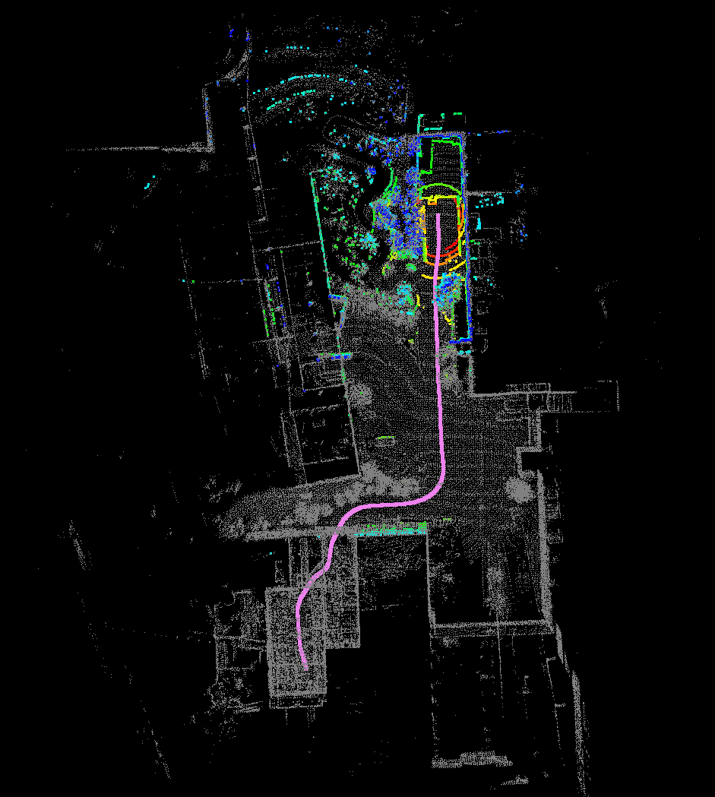

# Oh-My-LOAM

Oh-My-LOAM is a ROS-free implementation of LOAM (J. Zhang and S. Singh. LOAM: Lidar Odometry and Mapping in Real-time). 
This implementation is modified from [A-LOAM](https://github.com/HKUST-Aerial-Robotics/A-LOAM). 

Comparing with A-LOAM, this implementation has following features:

- it's ROS-free
- it's more readable and easier to understand/modify



# How to run
## BUILD

Install dependences (listed below).\
Clone this repository\
Compile: 
```bash
mkdir build && cd build
cmake ..
make -j6
```

## Run with ROS bag as input
Although **Oh-My-LOAM** is ROS-free, running it with ROS bag as input is the simplest way.
We'll take *nsh_indoor_outdoor.bag* as example. 
You can download this bag from [google drive](https://drive.google.com/file/d/1s05tBQOLNEDDurlg48KiUWxCp-YqYyGH/view) or [baidupan](https://pan.baidu.com/s/1TbfMQ3Rvmmn1hCjFhXSPcQ) (提取码:9nf7).

Launch: 
```
./devel/lib/oh_my_loam/main_rosbag ../configs/config_nsh_indoor_outdoor.yaml
```
Play bag:
```
ros play nsh_indoor_outdoor.bag
```

## Run without ROS support
You can write by yourself.

# Dependences

### C++17
### Eigen: linear algebra, quaternion
```
sudo apt install libeigen3-dev
```

### pcl: point cloud processing
```
sudo apt install libpcl-dev
```

### g3log: logging
Follow [g3log](https://github.com/KjellKod/g3log) to install.

### yaml-cpp: yaml parsing
```
sudo apt install libyaml-cpp-dev
```

### ceres: non-linear optimization
```
sudo apt install libceres-dev
```

### ROS (optional)
